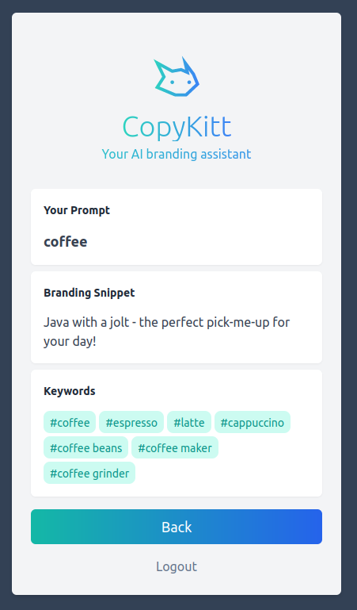

# Copykitt: Tutorial Project

This is a SaaS application that generates AI branding snippets and keywords for the customer's brand. 
It is a full stack application, and created as a tutorial for how to create AI driven full-stack
SaaS apps.

## Examples

Try out the demo here (requires authentication): https://www.copykitt.co



## Lambda Layer ZIP

I've decided to actually commit the Lambda layer zip file itself along with the project since a
few people have told me they have trouble building this Docker image themselves.

So you can either follow the tutorial and try to build it (it's easier on a Linux or Mac), or if
it doesn't work, then just use the `copykitt-infra/lambda_base_layer/layer.zip` file I have provided.

## Tech Stack

#### Backend Stack

| Type      | Tech                                                         |
| --------- | ------------------------------------------------------------ |
| Language  | [Python](https://www.python.org/)                            |
| Framework | [FastAPI](https://fastapi.tiangolo.com/)                     |
| Hosting   | [AWS](https://aws.amazon.com/) (Lambda + API Gateway)        |
| Other     | [OpenAI](https://openai.com/), [AWS CDK](https://aws.amazon.com/cdk/), [Docker](https://www.docker.com/) |

#### Frontend Stack

| Type      | Tech                                                         |
| --------- | ------------------------------------------------------------ |
| Language  | [Typescript](https://www.typescriptlang.org/)                |
| Framework | [NextJS](https://nextjs.org/) / [React](https://reactjs.org/) |
| Styling   | [TailwindCSS](https://tailwindcss.com/)                      |
| Hosting   | [Vercel](https://vercel.com)                                 |

### create a new project with cdk:
```bash
cdk --version
cdk init --language typescript 
```
(you can use python, but typesciprt is the native language of cdk preferblaly to use it.)
this somand creates for us a bunch of files:
we care about
- bin/copykitt-infrastructure.ts: instantiate the copykitt-infreastructure-stack
- lib/copykitt-infreastructure-stack.ts: is a logical grouping of aws services/resources (a stack is a service/resource)

in lib/copykitt-infreastructure-stack.ts:
- create a lambda function it need 3 args (this, nameOftheFunction, props)
props takes 3 args : runtime, code, handler

there is a tool that help you wrap up your code into a handler: "mangum"
```bash
pip install mangum
```

### NOW, for code deployment.
deploy our lambda function (it won't work yet but just let's try it)
```bash
#1. Run the bootstrap command: /done only once
cdk bootstrap aws://account-id/region
#2. Deploy => to build and deploy this infra
cdk deploy
#3. 
```

### Create lambda_base_layer

Docker file: will create for us an image for our app
generate_base_layer: it's a helper/automation file, with commads for creating and building image from the focker file

```bash
mkdir copykitt-infrastructure/lambda_base_layer
vim Dockerfile
vim generate_base_layer.sh
vim requirements.txt
```
### add OPENAI_API_KEY envirment variable:
- on the lambda function definition
- add .env file (encrypted by default) and don't foget to add it to your .gitignore
- yard add dotenv (use dotenv to read the env var from .env file)
    dotenv.config()
    OPENAI_API_KEY : process.env.OPENAI_API_KEY (this should be named OPENAI_API_KEY exact)

### Test the lambda function 
- to test it we should create a test event 'GenerateSnipet' of type :
    API Gateway proxy
    change the path to the path of our function : /generate_snippet
    add the prompt: 
    change foo with prompt (it's value coffe for example)
- another one 'GenerateKeywords'
    API Gateway proxy
    change the path to the path of our function : /generate_keyword
    add the prompt: 
    change foo with prompt (it's value coffe for example)

## Add the API Gateway Integration
to get a nice entrypoint to our application/ that call our lambda funtion.

- lambda api Integration as **proxy**    
we will use API Gateway as a proxy, we want it to get the result and give back directly to lambda without processing it, because we have our processing layer in copykitt api.

### Test our api:
1. from the generated url after cdk deploy of the apigateway: https://sf7f9opji9.execute-api.us-east-1.amazonaws.com/prod/**generate_snipet?prompt=coffee**

2. from the created stack, go on resources an look for the RestAPI physicalID:
    select ANY, click Test and enter 
    - http method: GET
    - path : generate_snipet
    - query : prompt=coffee


